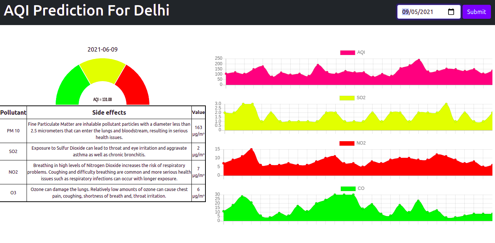
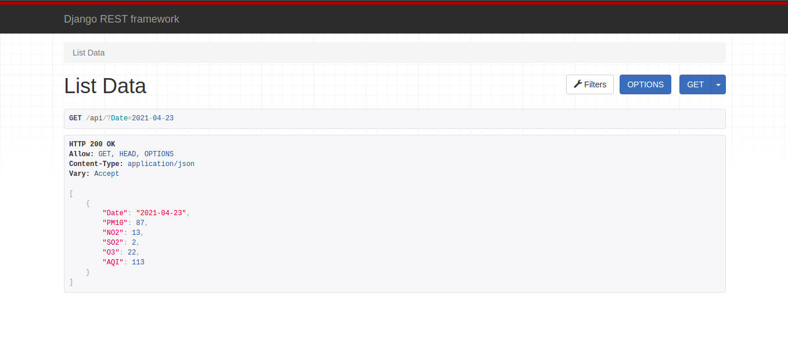

It is not an unknown fact that air pollution will endanger human health and life in big
cities, especially for the elderly and children. This is not an individual problem but a
global one.With cutting edge technology entering the world every moment, it is our duty
to think about the community as well, and henceforth integrate tech and people. Many
countries in the world have, therefore, made air pollution monitoring and control stations
in many cities.
PM2.5 refers to the mass per cubic meter of air of particles with a size (diameter)
generally less than 2.5 micrometers (μm). They’re essentially tiny particles in the air that
reduce visibility and cause the air to appear hazy when levels are elevated, thus
contributing to air pollution. In this project, different machine learning models have been
employed to detect PM2.5 levels based on a data set consisting of daily atmospheric
conditions.

## Approach:
1. Obtain the dataset containing AQI and air quality data at hourly and daily level
of various stations across multiple cities in India.(This data has been made
publicly available by the Central Pollution Control Board)
2. Dataset preprocessing/cleaning(maximising its information content) + Data
Visualization using Seaborn/Matplotlib
3. Used time series forecasting methods to predict AQI at any given time using models like Arima, Sarimax, etc.
4. For each day, collected the original data from getambee.com's API, which gets added to the training dataset.  Predict AQI for the next 7 days.
5. If someone searches for the AQI at a date that's before than or equal to the current date, they will get the information from the original dataset. However, if they want the index for some point in the future, the predicted AQI will be displayed.
6. A cron job runs that scrapes the data, updates the database daily and runs the ML function.
7. To save the data and run shell commands from python script.
8. Deployed the project on web using Django
9. Built REST api using django-restframework for the project so that 3rd party users can access the predicted AQI at any date using https://localhost:8000/api/?Date=

